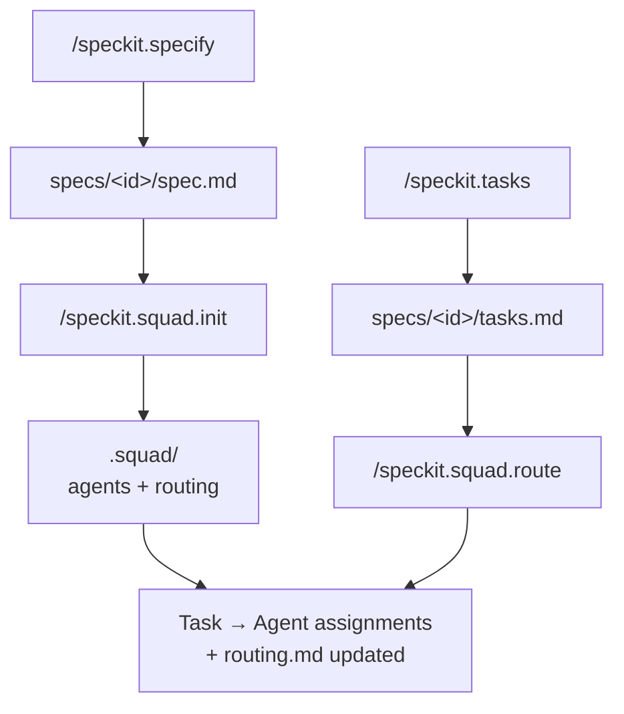
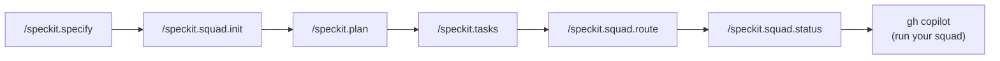

# spec-kit-squad

A [Spec Kit](https://github.com/github/spec-kit) extension that bridges
[Squad](https://bradygaster.github.io/squad/) — bootstrapping and
synchronizing an AI agent team directly from your spec.

**Speckit generates the *what*** (spec → plan → tasks).  
**Squad manages the *who*** (agents with specialized capabilities).  
**This extension connects them.**

---

## How It Works



After you specify your project, the extension reads the spec, infers
technology domains and roles, and generates a Squad team to match. As your
spec evolves, `generate` keeps the team in sync. When tasks are generated,
`route` distributes them to the right agents automatically.

---

## Requirements

- [Spec Kit](https://github.com/github/spec-kit) `>=0.8.11`
- [Squad](https://bradygaster.github.io/squad/) `>=0.9.4`

```bash
npm install -g @bradygaster/squad-cli
```

---

## Installation

```bash
specify extension add squad --from https://github.com/jwill824/spec-kit-squad/archive/refs/tags/v1.3.0.zip
```

Or for local development:

```bash
specify extension add squad --dev /path/to/spec-kit-squad
```

---

## Commands

> **Invoking commands by tool:**
>
> - **Claude Code / VS Code Copilot:** Type `/speckit.squad.<command>` directly
> - **GitHub Copilot CLI:** Type `/agents` → select `speckit.squad.<command>` → enter your prompt

### `/speckit.squad.init`

Bootstrap a Squad team from the current spec. Run this once after your
initial `/speckit.specify`.

- Reads `specs/<id>/spec.md` and (optionally) `specs/<id>/tasks.md`
- Infers technology domains, roles, and cross-cutting concerns
- Runs `squad init` if `.squad/` doesn't exist
- Creates agent definitions in `.squad/agents/`
- Generates routing rules in `.squad/routing.md`
- Writes `squad.config.ts` at the project root

```
/speckit.squad.init
```

---

### `/speckit.squad.generate`

Re-generate agent definitions as the spec evolves. Safe to run repeatedly —
agents are updated in place; removed domains are marked `inactive`, not
deleted. Also triggered by the `after_specify` hook.

```
/speckit.squad.generate
/speckit.squad.generate frontend   # limit to a specific domain
```

---

### `/speckit.squad.route`

Route open Speckit tasks to Squad agents using capability matching. Also
triggered by the `after_tasks` hook.

```
/speckit.squad.route
/speckit.squad.route --update-tasks   # annotate tasks.md with assignments
```

---

### `/speckit.squad.status`

Health check: cross-reference the spec, tasks, and squad to surface coverage
gaps and idle agents.

```
/speckit.squad.status
/speckit.squad.status --brief   # summary only
```

---

## Configuration

After installation, copy the config template:

```bash
cp .specify/extensions/squad/squad-config.template.yml \
   .specify/extensions/squad/squad-config.yml
```

Key options:

| Option | Default | Description |
| --- | --- | --- |
| `agent_model` | `claude-sonnet-4` | Model used when generating agents |
| `routing_strategy` | `capability-match` | `capability-match` or `round-robin` |
| `squad_root` | `.squad` | Path to Squad root directory |
| `model_tiers.full` | `claude-opus-4` | Model for complex tasks |
| `model_tiers.standard` | `claude-sonnet-4` | Model for standard tasks |
| `model_tiers.lightweight` | `claude-haiku-4.5` | Model for simple tasks |

---

## Hooks

| Hook | Command | Default |
| --- | --- | --- |
| `after_specify` | `speckit.squad.generate` | Optional (prompts user) |
| `after_tasks` | `speckit.squad.route` | Optional (prompts user) |

---

## Typical Workflow



---

## Troubleshooting

**`squad: command not found`**
Squad is not installed. Run `npm install -g @bradygaster/squad-cli` and verify with `squad --version`.

**`/speckit.squad.init` reports no spec found**
Run `/speckit.specify` first — the init command reads `specs/<id>/spec.md`.

**Agents not appearing after init**
Check `.squad/agents/` exists. If the directory is missing, Squad CLI may not have initialized correctly. Try `squad init` manually, then re-run `/speckit.squad.init`.

**Hook fires unexpectedly**
Both hooks (`after_specify`, `after_tasks`) are optional and will prompt before running. If you want to disable them, remove the `hooks:` section from your local copy of `extension.yml` or set the hook's `optional: false` to always skip the prompt.

---

## License

MIT
