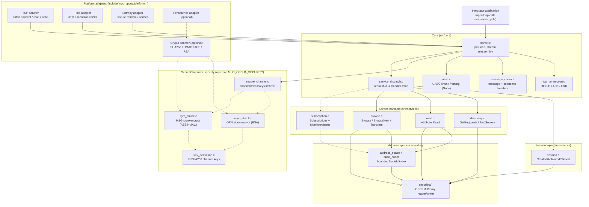
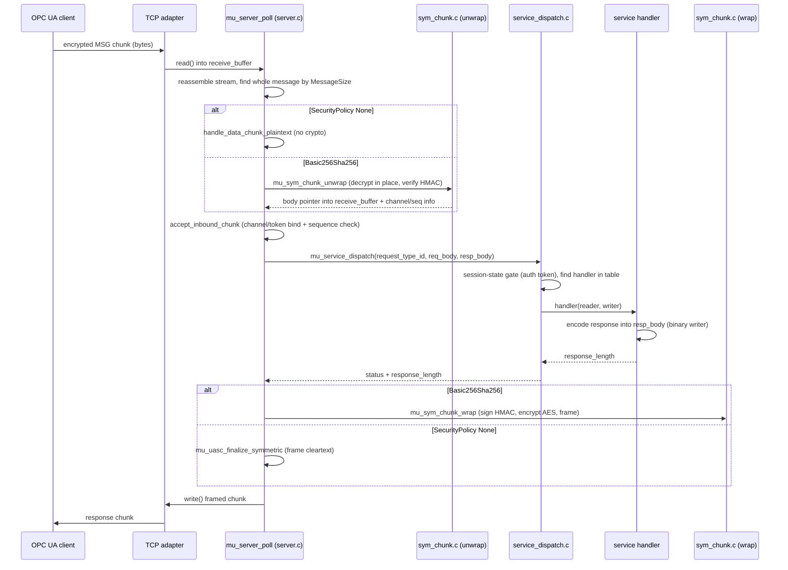

# Architecture Overview

`muc-opcua` is a freestanding C11 OPC UA **server** library for deeply embedded
targets (down to a Cortex-M0+ class MCU). It implements the OPC UA TCP / UA-SC /
UA-Binary stack with **no heap allocation**, talking to its host through a narrow
set of platform adapters. This document explains how the pieces fit together; for
the per-service and per-profile conformance detail, follow the links into
[`docs/conformance/`](conformance/).

> Scope note: this is an architecture map of the real source tree, not a tutorial.
> For getting a server running see [`getting-started.md`](getting-started.md) and
> [`integration-guide.md`](integration-guide.md). The host reference binary built
> by the examples lives at `build/<profile>/examples/minimal_server`.

---

## 1. Design goals & principles

| Principle | How it shows up in the code |
|-----------|-----------------------------|
| **Freestanding C11** | Only `<stddef.h>`, `<string.h>`, `<stdbool.h>`, fixed-width ints. No libc allocator, no OS calls outside the adapters. |
| **No heap — caller-provided memory** | `mu_server_init(void *storage, size_t storage_size, ...)` places the entire `struct mu_server` in caller storage (typically a `static` buffer). Receive/send buffers are caller-owned (`mu_server_config_t.receive_buffer` / `send_buffer`). All session, subscription, and channel state are fixed-size arrays. See `MU_SERVER_STORAGE_BYTES` in `include/muc_opcua/config.h`. |
| **Narrow platform-adapter boundary** | Everything host-specific is a vtable struct in `include/muc_opcua/platform.h`: TCP, time, entropy, and the optional persistence and crypto adapters. The core never calls a socket or a clock directly. |
| **OPC UA spec fidelity** | Handlers cite the governing clauses (OPC 10000-4/-6/-7). Wire framing, sequence-number validation, and the binary encoding follow the spec; deviations are documented as "thin path" in the service matrix. |
| **Size discipline** | Optional services and the whole security/subscription layers compile out (`MUC_OPCUA_*` options). Built with `--gc-sections`; the size ledger lives in [`docs/size/`](size/). |
| **Multiplexed TCP connections, ≥2 logical sessions** | The poll loop services up to `MU_MAX_CONNECTIONS` (default 4) sockets concurrently. The server holds `sessions[MU_MAX_SESSIONS]` (default 2), allowing multiple OPC UA Sessions to be multiplexed across active SecureChannels. |
| **Cooperative poll loop** | No threads, no blocking. `mu_server_poll()` does one non-blocking pass (accept → read → reassemble → dispatch → reply → subscription tick) and returns. The integrator calls it from their own super-loop or timer task. |

---

## 2. Layered architecture

Data flows from the host's transport up through framing, the secure channel, the
session/dispatch layer, into the service handlers, and finally the address space
and binary codecs. Optional layers (security, subscriptions, individual services)
are dashed.



---

## 3. Request lifecycle (a secured request)

`mu_server_poll()` accepts at most one connection, reads into the caller's receive
buffer, and reassembles the TCP stream into whole UASC messages (a read may carry
several messages or a partial one — `MessageSize` at byte offset 4 delimits each).
Each complete message goes to `process_message()`, which routes HELLO during
connect and OPN/MSG/CLO chunks afterward. When a crypto adapter is configured the
secure path runs; otherwise the plaintext (SecurityPolicy None) path runs.

The sequence below shows a **MSG request on a Basic256Sha256 channel**. The
SecurityPolicy None path is identical minus the unwrap/decrypt and wrap/encrypt
steps (the body is framed in cleartext by `uasc.c`).



Notes that the diagram compresses:

- **In-place decrypt.** A secured MSG chunk is decrypted *inside the receive
  buffer* (`mu_sym_chunk_unwrap` returns a pointer into it) — no request scratch
  buffer is reserved. Only the response body uses server-owned scratch
  (`secure_scratch`). An OPN request is the exception: it is unwrapped into a small
  scratch region (`MU_SECURE_OPN_REQ_MAX`).
- **Always answer.** If a handler returns non-`GOOD`, the core writes a
  `ServiceFault` rather than letting the client time out (`mu_write_service_fault`).
- **Abort on violation.** A replayed/skipped SequenceNumber or a chunk addressed to
  the wrong channel/token aborts the connection (`accept_inbound_chunk` → close).
- **Single chunk per poll.** Because the server processes connections sequentially per poll iteration, the shared
  secure scratch is never re-entered while a request/response is in flight.

---

## 4. SecureChannel / Session / Subscription model

### SecureChannel (`src/services/secure_channel.{c,h}`)
One channel per connection (`MU_MAX_SECURE_CHANNELS == 1`). State: `channel_id`,
`token_id`, `revised_lifetime`, an inbound `mu_sequence_validator_t`, a monotonic
outbound `out_sequence_number`, the negotiated `policy` (None / Basic256Sha256) and
`mode` (None / Sign / SignAndEncrypt), and — under `MUC_OPCUA_SECURITY` — the two
per-direction `mu_sym_keys_t` (client→server for decrypt/verify, server→client for
encrypt/sign) plus a `keys_valid` flag. `OpenSecureChannel` records the mode and,
for a secured channel, derives both key sets from the client/server nonces
(OPC 10000-6 §6.7.5) and prepares the per-direction cipher contexts. Lifetime is
enforced in the poll loop: an idle channel past `revised_lifetime` (or a peer that
never opens a channel within `MU_CONNECT_TIMEOUT_MS`) is dropped so the single slot
can be reused.

### Session (`src/services/session.{c,h}`)
`sessions[MU_MAX_SESSIONS]` (default 2) — **multiple active connections multiplex ≥2
logical Sessions**, fulfilling the Micro profile requirement. Each session is a tiny state
machine: `CLOSED → CREATED → ACTIVATED`. `CreateSession` allocates a free slot and
assigns a `session_id` and `auth_token`; `ActivateSession` validates the auth token
and supports Anonymous, Username, or X509 identity tokens (else `Bad_IdentityTokenInvalid`);
`CloseSession` frees the slot and deletes the session's subscriptions. The
RevisedSessionTimeout is stored as the **raw IEEE-754 bits** of the Duration and
clamped by integer comparison, so no FPU is needed.

### Subscriptions (`src/services/subscription.{c,h}`, `MUC_OPCUA_SUBSCRIPTIONS`)
A no-heap data-change engine implementing the Embedded Data Change Subscription
Server Facet. All state is fixed-size arrays inside `struct mu_server`:
`subscriptions[MU_MAX_SUBSCRIPTIONS]`, `monitored_items[MU_MAX_MONITORED_ITEMS]`,
and a `publish_queue[MU_MAX_PUBLISH_REQUESTS]`.

- **Sampling.** `mu_subscriptions_tick()` runs once per `mu_server_poll` with the
  current monotonic tick. Each due MonitoredItem is sampled against the address
  space; a `DataChangeFilter` trigger (Status / StatusValue) decides whether the
  value changed; the first sample is always reported. Changes are queued as
  `pending`.
- **Publishing.** `Publish` requests are *parked* in the fixed queue and answered
  asynchronously when the publishing timer fires — with a `DataChangeNotification`
  if items are pending, otherwise (after `max_keep_alive_count`) an empty
  keep-alive `NotificationMessage`. The async response is framed and sent through
  `mu_server_emit_message()`, which reuses the same None/secured framing as a
  synchronous reply.
- **Republish.** The last NotificationMessage body is retained in a per-subscription
  `mu_retransmit_slot_t` (`MU_RETRANSMIT_BYTES`) so `Republish` can resend it;
  `SubscriptionAcknowledgements` purge it.
- **FPU-free.** Durations (publishing/sampling intervals) are converted to integer
  milliseconds at the dispatch boundary with bit math; the engine itself is
  floating-point-free.

See [`conformance/profile-micro.md`](conformance/profile-micro.md) and the per-service
status in [`conformance/services.md`](conformance/services.md).

---

## 5. Profiles as compile-time feature composition

There is no runtime profile switch. A profile is a **set of CMake options** that
gate source files (via `target_sources`) and dispatch-table rows (via
`MUC_OPCUA_*` compile definitions). Dropping a feature removes both its code and
its fixed-size state. The options live in the root `CMakeLists.txt`; the source
gating is in `src/CMakeLists.txt`.

| CMake option | Compile define | Gates |
|--------------|----------------|-------|
| `MUC_OPCUA_SERVICE_READ` | `MUC_OPCUA_SERVICE_READ` | `read.c` + the Read dispatch row |
| `MUC_OPCUA_SERVICE_BROWSE` | `MUC_OPCUA_SERVICE_BROWSE` | `browse.c` + Browse/BrowseNext/Translate rows |
| `MUC_OPCUA_SERVICE_DISCOVERY` | `MUC_OPCUA_SERVICE_DISCOVERY` | GetEndpoints/FindServers rows |
| `MUC_OPCUA_SERVICE_REGISTER_NODES` | `MUC_OPCUA_SERVICE_REGISTER_NODES` | RegisterNodes/UnregisterNodes rows |
| `MUC_OPCUA_BASE_NODES` | `MUC_OPCUA_BASE_NODES` | the standard Base Information node-set content |
| `MUC_OPCUA_SUBSCRIPTIONS` | `MUC_OPCUA_SUBSCRIPTIONS` | `subscription.c` + all subscription/MonitoredItem rows + engine state |
| `MUC_OPCUA_SECURITY` | `MUC_OPCUA_SECURITY` | `asym_chunk.c`, `sym_chunk.c`, `key_derivation.c`, `certificate.c` + secure paths + `secure_scratch` |

The dispatch table (`g_supported_services[]` in `service_dispatch.c`) is built with
`#ifdef`/`#if` around each row, so an unbuilt service is simply absent from the
table and its request returns a fault. `OpenSecureChannel` and the Session services
are always present.

Profile shorthand (the `Makefile` wires the first three into `make nano` /
`make micro` / `make embedded`; `standard`/`full` are `-DMUC_OPCUA_PROFILE=...`):

- **Nano** = Core Server Facet + UA-TCP/UA-SC/UA-Binary + SecurityPolicy None +
  Anonymous identity. Subscriptions OFF.
- **Micro** = Nano + data-change subscriptions (`MUC_OPCUA_SUBSCRIPTIONS`).
- (All profiles multiplex up to `MU_MAX_SESSIONS` (default 2) logical sessions over the
  `MU_MAX_CONNECTIONS` TCP connections — it is a core capability, not profile-specific.)
- **Embedded (2017)** = security policies on top, i.e.
  `MUC_OPCUA_SECURITY` (Basic256Sha256) and Standard DataChange subscriptions.
- **Standard (2017)** = Embedded + Write, History, Query, NodeManagement, PubSub,
  Data Access, Method Server, Auditing, Complex Types, Redundancy, Reverse Connect,
  the full Aggregate set, and the optional ECC SecurityPolicies (`MUC_OPCUA_ECC`,
  spec 059 — `#ECC_curve25519`/`#ECC_nistP256` alongside Basic256Sha256/
  Aes128_Sha256_RsaOaep/Aes256_Sha256_RsaPss; see §7).
- **Full** = same feature set as Standard, not a distinct OPC UA profile — larger
  capacity presets (`MU_MAX_*`) only.

Every named profile is a preset; any individual flag can be added on top of or
removed from a profile's defaults on the same `cmake` invocation (e.g. "standard
minus the crypto layer") — this is a separate mechanism from the profile
selection above. See [`build-and-gating.md`](build-and-gating.md) for the full
`MUC_OPCUA_*` flag reference, the override/subtraction semantics, and the
cross-feature dependency checks that keep an overridden combination from
silently building something inconsistent.

Profile definitions and current status:
[`conformance/profile-nano.md`](conformance/profile-nano.md),
[`conformance/profile-micro.md`](conformance/profile-micro.md),
[`conformance/profile-embedded.md`](conformance/profile-embedded.md).

---

## 6. Encoding layer

`src/encoding/*` implements the **OPC UA Binary** encoding (OPC 10000-6 §5) over the
public API in [`include/muc_opcua/encoding.h`](../include/muc_opcua/encoding.h).

- **Byte-at-a-time, endian-portable.** The primitive helpers in
  `encoding/binary_le.h` read and write multi-byte integers with explicit shifts
  (`dst[0] = value & 0xFF; dst[1] = (value >> 8) & 0xFF; ...`). There is no cast to
  a wider type and no host-endian or alignment assumption, so the codec is safe on a
  Cortex-M0+ where an unaligned word access faults and the host may be big-endian.
- **Sticky-status reader/writer.** `mu_binary_reader_t` / `mu_binary_writer_t` each
  carry a `position` and a sticky `status`. The first failure (truncation, overflow,
  decoding error) latches into `status`, and subsequent chained calls become no-ops.
  Handlers can therefore issue a run of `mu_binary_read_*` / `mu_binary_write_*`
  calls and check the status once instead of after every field — bounds are still
  enforced on each call.
- **Type coverage.** Scalars, `String`/`ByteString` (length-prefixed, bounded by
  `MU_MAX_ENCODED_STRING_LENGTH`), `NodeId`, `ExtensionObject` headers, `Variant`,
  and `DataValue` — enough for the Nano/Micro service surface.

### Bounded address-space lookup
`src/address_space/*` plus `include/muc_opcua/address_space.h`. An address space is
a flat, `const` array of `mu_node_t` (NodeId, class, browse/display name, a
references array, and an optional value source that is either a static `Variant` or
a read callback). Lookups use a **bounded index** (`mu_address_space_index_t`): up
to `MU_MAX_ADDRESS_SPACE_NODES` (default 64) node indices sorted by a NodeId sort
key for binary search, confirmed with `mu_nodeid_equal`; if the node count exceeds
the cap, it falls back to a linear scan. The standard Base Information node set
(`base_nodes.c`) is resolved as a fallback after the integrator's own nodes, with
`ServerStatus.CurrentTime`/`StartTime` bound to live runtime value sources.

---

## 7. Security architecture

Security is entirely optional and compiles out under `MUC_OPCUA_SECURITY=OFF`,
leaving a SecurityPolicy-None-only build with no crypto code. When enabled, the
server supports **None, Basic256Sha256, Aes128_Sha256_RsaOaep, and
Aes256_Sha256_RsaPss** (OPC 10000-7), plus, under the further-optional
`MUC_OPCUA_ECC` (spec 059, default ON for standard/full, requires
`MUC_OPCUA_SECURITY`), the **ECC SecurityPolicies** `#ECC_curve25519` and
`#ECC_nistP256` (the optional "Security ECC Policy" CU).

- **Pluggable crypto adapter.** All primitives are function pointers on
  `mu_crypto_adapter_t` (`platform.h`): SHA-256, HMAC-SHA256, AES-256/128-CBC
  (one-shot *and* an optional per-channel cipher context), RSA-PKCS1.5-SHA256 and
  RSA-PSS-SHA256 sign/verify, RSA-OAEP (MGF1-SHA1 and MGF1-SHA256) encrypt/decrypt,
  certificate accessors (own cert, key bits, thumbprint, validity/application-URI
  checks), and — when `MUC_OPCUA_ECC` — ephemeral ECDH keygen/derive, ECC
  sign/verify, a per-curve certificate accessor, and ChaCha20-Poly1305 AEAD. The
  server's own certificate(s) and private key(s) live in the adapter's `context`;
  the library never owns key material. Three backends ship: OpenSSL (host,
  `src/platform/host_crypto/`, both ECC curves), wolfSSL
  (`src/platform/wolfssl_crypto/`, both ECC curves), and mbedTLS
  (`src/platform/mbedtls_crypto_adapter.c`, ECC-nistP256 only — mbedTLS has no
  Ed25519, which curve25519's OPN signature requires).
- **Key derivation.** `key_derivation.c` implements **P-SHA256** (RFC 5246 §5) for
  the RSA policies, and **HKDF-SHA256** (RFC 5869) for ECC. `OpenSecureChannel`
  derives two `mu_sym_keys_t` sets from the client/server nonces (RSA: signing key ‖
  encrypting key ‖ IV per direction, OPC 10000-6 §6.7.5; ECC: ephemeral-ECDH shared
  secret through HKDF with the `ServerSalt`/`ClientSalt` construction, §6.8.1).
- **Per-channel cipher context.** Each direction's `mu_sym_keys_t` carries an opaque
  `cipher_ctx[MU_CIPHER_CTX_SIZE]` (default 512 B) prepared once via
  `cipher_ctx_init`, so a backend can keep its AES key schedule instead of re-keying
  per chunk. If the adapter leaves those callbacks NULL, the codec falls back to the
  one-shot `aes256_cbc_*`/`aes128_cbc_*`.
- **Chunk protection.** `asym_chunk/{wrap,unwrap}.c` protects the OPN handshake: for
  the RSA policies, OAEP-encrypt to the peer cert + PKCS1.5/PSS-sign with the own
  key + thumbprint check; for ECC, **signed-only** (ECC provides no asymmetric
  encryption — the ephemeral public keys ride in the Client/ServerNonce instead,
  §6.8.1). `sym_chunk.c` protects MSG/CLO chunks two ways: HMAC-SHA256-sign +
  AES-CBC-encrypt (sign-then-encrypt, signature inside the ciphertext) for the RSA
  policies and ECC-nistP256; ChaCha20-Poly1305 AEAD for ECC-curve25519 (nonce = the
  derived IV XOR `TokenId‖LastSequenceNumber`, Table 69).
- **In-place decrypt.** Inbound MSG chunks are decrypted within the receive buffer
  (no per-request scratch); only response bodies use `secure_scratch`.
- **Secret zeroization.** `mu_secure_zero()` (in `key_derivation.c`) clears derived
  key material and transient secrets so they do not linger in RAM.

Details and the threat-model caveats (e.g. None is for trusted/isolated networks
only) are in [`conformance/security.md`](conformance/security.md) and
[`conformance/ecc-security-policy.md`](conformance/ecc-security-policy.md).

---

## 8. Source-tree map

| Path | Responsibility |
|------|----------------|
| `include/muc_opcua/` | Public API: `server.h` (lifecycle + config), `platform.h` (adapter vtables), `config.h` (compile-time knobs + storage sizing), `address_space.h`, `encoding.h`, `types.h`/`opcua_types.h`/`opcua_ids.h`, `status.h`. |
| `src/core/server.c` | Poll loop, accept, stream reassembly, plaintext + secure chunk handling, idle/lifetime timeouts, response framing. |
| `src/core/service_dispatch.c` | Request-id → handler table; session-state gating; all service-handler implementations except discovery; response-prefix and ServiceFault helpers. |
| `src/core/tcp_connection.c` | UA-TCP connect handshake: HELLO/ACK negotiation, ERR messages. |
| `src/core/message_chunk.c` | Parse/write the UASC MessageHeader and SequenceHeader. |
| `src/core/uasc.c` | Frame symmetric (MSG) and asymmetric-None (OPN) chunks for SecurityPolicy None. |
| `src/core/sequence.c` | Inbound SequenceNumber validation; monotonic outbound counter helper. |
| `src/core/service_message.c` / `service_header.c` (services) | Request/Response header encode/decode. |
| `src/services/secure_channel.c` | SecureChannel open/renew/close, token + key lifetime. |
| `src/services/session.c` | Session slot allocation and Created/Activated/Closed state machine. |
| `src/services/discovery.c` | GetEndpoints / FindServers; endpoint + application descriptions. |
| `src/services/read.c` | Attribute Read over the address space. |
| `src/services/browse.c` | Browse / BrowseNext / TranslateBrowsePathsToNodeIds (the View set). |
| `src/services/subscription.c` | No-heap subscription + MonitoredItem engine, sampling, Publish/Republish (Micro). |
| `src/security/security_policy.c` | Policy/mode enums + URI mapping + per-policy parameter table (RSA + ECC rows; always built). |
| `src/security/asym_chunk/{wrap,unwrap}.c` | OPN asymmetric sign+encrypt/unwrap (RSA) and signed-only sign/verify (ECC). |
| `src/security/sym_chunk.c` | MSG/CLO symmetric sign+encrypt/unwrap (AES/HMAC for RSA + ECC-nistP256; ChaCha20-Poly1305 AEAD for ECC-curve25519) + key-set storage. |
| `src/security/key_derivation.c` | P-SHA256 (RSA) + HKDF-SHA256 (ECC) channel-key derivation + `mu_secure_zero`. |
| `src/security/asym_ecc.c` | ECC ephemeral-ECDH channel-key derivation (HKDF salt/info construction, spec 059; `MUC_OPCUA_ECC` only). |
| `src/security/certificate.c` | Certificate helpers used by the secure handshake. |
| `src/encoding/` | OPC UA Binary reader/writer for scalars, strings, NodeIds, ExtensionObjects, Variants, DataValues; `binary_le.h` endian-portable primitives. |
| `src/address_space/` | Node model, bounded NodeId index, NodeId helpers, value sources, and the standard Base Information node set (`base_nodes.c`). |
| `src/generated/opcua_ids.c` | Generated well-known ns=0 NodeId constants. |
| `src/platform/` | Host reference adapters: POSIX TCP (`host_tcp_adapter.c`); crypto backends OpenSSL (`host_crypto/`, both ECC curves), mbedTLS (`mbedtls_crypto_adapter.c`, ECC-nistP256 only), wolfSSL (`wolfssl_crypto/`, both ECC curves). |
| `examples/` | `minimal_server` reference app → built at `build/<profile>/examples/minimal_server`. |
| `platform/` | Non-host platform integration (e.g. Pico SDK). |
| `docs/conformance/` | Profile and service/security conformance: `profile-nano.md`, `profile-micro.md`, `profile-embedded.md`, `services.md`, `security.md`, `ecc-security-policy.md`. |
| `docs/build-and-gating.md` | Every `MUC_OPCUA_*` CMake flag, profile composition, and how to override a profile's defaults. |

---

## Putting it together: the poll loop

```c
/* Integrator super-loop (host or MCU) */
static uint8_t storage[MU_SERVER_STORAGE_BYTES] __attribute__((aligned(__BIGGEST_ALIGNMENT__)));
mu_server_t *server;
mu_server_init(storage, sizeof storage, &config, &server);
for (;;) {
    mu_server_poll(server);   /* one non-blocking pass: accept/read/dispatch/reply/tick */
    /* ... application work, sleep until next tick ... */
}
```

Everything above — framing, the secure channel, sessions, dispatch, handlers,
sampling — runs inside that single non-blocking `mu_server_poll()` call, against
caller-owned memory and the platform adapters. That is the whole runtime model.
