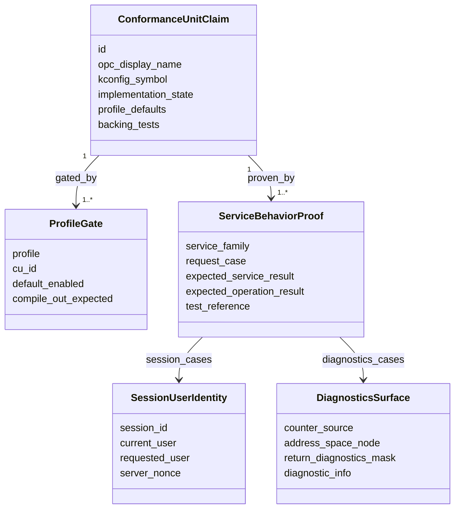

<!-- markdownlint-disable MD013 -->

# Internal Object Design

The feature uses the existing CU-aligned service modules and manifest generator. No new public object model is required.

## Responsibilities

- `ConformanceUnitClaim`: keeps manifest state, symbol, profile defaults, tests, and normative evidence together.
- `ProfileGate`: prevents optional or micro+ CUs from becoming nano-default claims accidentally.
- `ServiceBehaviorProof`: connects service-level behaviour to tests and OPC UA StatusCode expectations.
- `SessionUserIdentity`: constrains ActivateSession change-user state transitions.
- `DiagnosticsSurface`: separates address-space diagnostics from service-return diagnostics.
