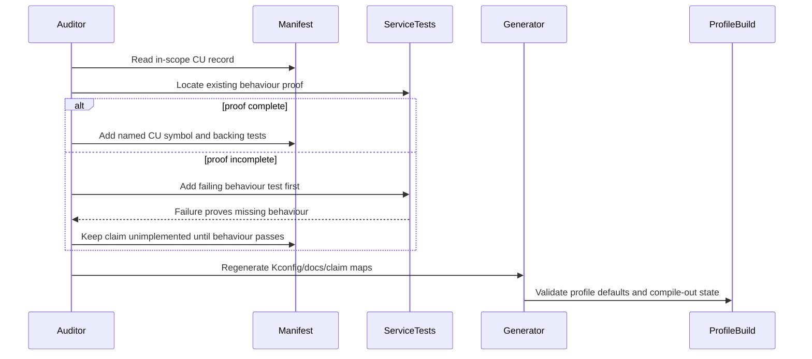
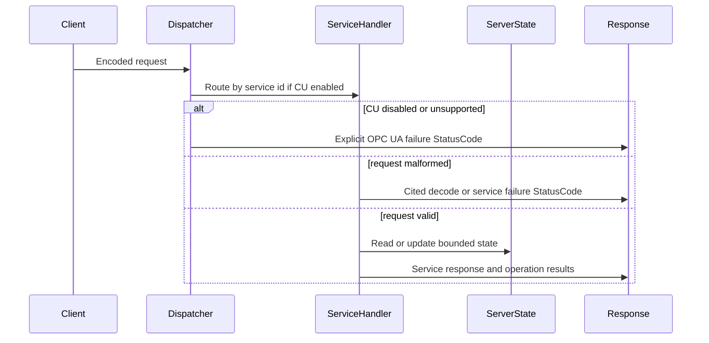

<!-- markdownlint-disable MD013 -->

# Service Sequences

## CU Claim Promotion



## Service Request Behaviour



## Diagnostics Response Behaviour

```mermaid
sequenceDiagram
    participant Client
    participant ServiceHandler
    participant Diagnostics
    participant ResponseHeader
    participant AddressSpace

    Client->>ServiceHandler: Request with returnDiagnostics mask
    ServiceHandler->>Diagnostics: Record service/request/session outcome
    alt Base Services Diagnostics enabled
        Diagnostics->>ResponseHeader: Available DiagnosticInfo or explicit empty result
    else diagnostics disabled
        Diagnostics->>ResponseHeader: No diagnostics claim; no fabricated data
    end
    Client->>AddressSpace: Read ServerDiagnostics nodes
    AddressSpace->>Diagnostics: Read live counters
```
